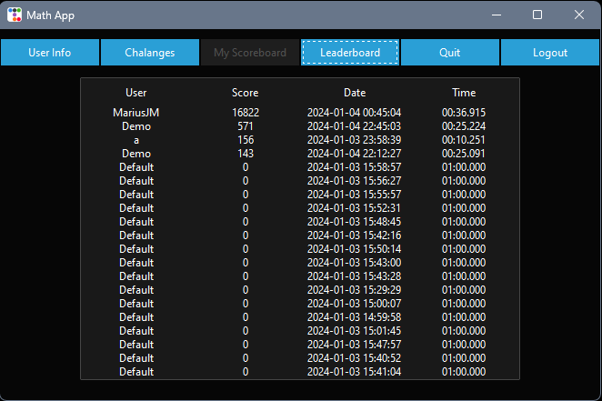

# Math Learning App

#### Video Demo: [https://youtu.be/4HqZhtSi7kU]

#### Description:

The Math Learning App is a Python-based application that serves as an interactive tool for users to improve their mathematical skills. The application provides various features:

- **User Authentication**: Users can log in or sign up to access personalized features. Users who already have an account can log in by providing their username and password. This step is essential for accessing personalized data, such as individual challenge history, scores, and leaderboard rankings. New users who don't have an account can sign up for one. During the sign-up process, users typically provide a unique username and a secure password. At this stage app does not enforce any password criteria (e.g., minimum length, special characters) to enhance security. The app employs secure authentication mechanisms, such as password hashing using the bcrypt library. Password hashing ensures that even if the user data is somehow compromised, passwords remain protected. The "Remember Me" option allows users to save their username for future logins. When this option is selected, the app stores the username locally in the "rememberMe.txt" file, providing a convenient way for users to log in without entering their username each time.

- **Math Challenges**: Users can participate in math challenges with different operators and adjustable difficulty levels. The app presents users with math challenges that involve various mathematical operators, such as addition, subtraction, multiplication, and division. This diversity ensures that users can practice and enhance their skills across different types of mathematical operations. Users have the flexibility to choose the difficulty level of the math challenges. Difficulty levels may range from easy to advanced, accommodating users with varying levels of mathematical proficiency. Each difficulty level is designed to present challenges appropriate to the user's skill, promoting continuous learning and improvement. Math challenges are presented in an interactive format, allowing users to solve problems directly within the application. Users can input their answers using the app's graphical user interface (GUI), providing a hands-on and engaging experience.To enhance variety and prevent predictability, the app may generate randomized math challenges for users. This ensures that each challenge is unique, providing a diverse learning experience. Math challenge scores may contribute to the app's leaderboard, promoting friendly competition among users. Users can see how their performance compares to others, fostering a sense of community and motivation. The Math Challenges feature is designed not only for entertainment but also to serve as an educational tool, helping users reinforce mathematical concepts in a practical and enjoyable manner.

- **Score Tracking**: The application tracks user performance based on correct answers, time taken, and difficulty. The application records the number of correct answers provided by the user during math challenges. This metric reflects the user's accuracy and proficiency in solving mathematical problems within the app. In addition to correct answers, the app tracks the time taken by the user to solve each math challenge. Timing information adds an extra dimension to performance evaluation, encouraging users to improve their speed and efficiency in problem-solving. The scores tracked by the app may contribute to the overall leaderboard. This integration fosters healthy competition among users and provides an additional incentive for users to strive for excellence.

- **Leaderboard**: A leaderboard showcases the scores of different users, promoting healthy competition. Users can see their own ranking as well as the scores of other participants, creating a dynamic and competitive environment. Each user is assigned a rank on the Leaderboard based on their overall performance in math challenges. Ranks are determined by factors such as the number of correct answers, completion time, and the chosen difficulty level. The Leaderboard serves as a powerful motivational tool by showcasing top performers. Seeing the achievements of others encourages users to strive for improvement and aim for a higher position on the Leaderboard.

- **Logout and Quit**: Users can log out or quit the application as needed. When a user logs in to the Math Learning App, a session is initiated to maintain their authentication status and personalized settings. The "Logout" option allows users to gracefully end their current session, ensuring that their account information and progress are securely managed. Clicking on the "Logout" option triggers the application to clear the user's session data, effectively logging them out. Logging out is essential for scenarios where multiple users share the same device, and each user wants to maintain their privacy and individual progress. The logout process incorporates security measures to protect user data. Any sensitive information stored locally or in the application's temporary memory is securely wiped clean to prevent unauthorized access. After logging out, users are redirected to the login screen where they can either log in again or switch to a different account. This step ensures a smooth transition between different user sessions without the need to restart the entire application. In addition to logging out, users can choose to "Quit" the application altogether. The "Quit" option closes the Math Learning App, ending the program and releasing any system resources it was utilizing.

### Files:

- **mathapp_client_secret.json**: Configuration file for connecting to Google Sheets API. The Google Sheets API requires proper authentication to access and modify spreadsheet data. The mathapp_client_secret.json file contains credentials and authentication information needed to establish a secure connection between the Math Learning App and the user's Google Sheets account. The file typically includes OAuth 2.0 credentials, which consist of a client ID and client secret. These credentials are generated and obtained through the Google Cloud Console when the application is set up to use the Google Sheets API.

- **project.py**: Main Python script containing the application's functionality, GUI, and logic.

- **rememberMe.txt**: Local storage for user names when the "Remember Me" option is selected.

### Usage:

1. Run `project.py` to start the application.
2. Log in or sign up to access personalized features.
3. Participate in math challenges, track scores, and compete on the leaderboard.

### Dependencies:

- `gspread`: For interacting with Google Sheets.
- `ttkbootstrap`, `tkinter`: For GUI components.
- `bcrypt`: For password hashing.

### Notes:

- The application offers a user-friendly interface for an engaging learning experience.
- User data is securely stored and accessed through Google Sheets.

### Future Enhancements:

- Include additional mathematical concepts and challenges.
- Improve UI/UX for a more polished appearance.

